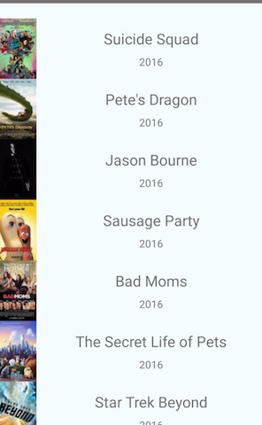

# React Native 之展示电影列表(v0.31)


## 更换RN入口

刚入门的`Hello World`的时候,组件都是写在`index.android.js`中的,这样如果写很多Demo都堆在一个js中会非常乱.

如下:

```javascript
class HelloWorld extends Component {
    render() {
        return (
            <Text>Hello World</Text>
        )
    }
}
AppRegistry.registerComponent('helloWordApp', () => HelloWorld);
```
不难看出`AppRegistry.registerComponent('helloWordApp', () => HelloWorld);`是入口关键.
最右边的`HelloWorld`对应的就是我们所写的组件类.我们只要将界面写在其他js中,然后手动修改右边的名称即可.

以此例子为例,建一个`ListMovies.js`文件.

**ListMovies.js**

```javascript
import React from 'react'
import {
    AppRegistry,
    Text,
    Image,
    StyleSheet,
    View,
    ListView,
} from 'react-native';

class ListMovies extends React.Component {
...
}

export default ListMovies;
```
最后的`export default ListMovies`是ES6的Module语法,导出对外接口.  
然后在`index.android.js`中通过`import ListMovies from './ListMovies'`导入  
**注意:**`ListMovies.js`需要写在同层级下才能用`./ListMovies`.  
更多参考:[http://es6.ruanyifeng.com/#docs/module#export-default命令](http://es6.ruanyifeng.com/#docs/module#export-default命令)

**index.android.js**

```javascript
import React from 'react';
import {AppRegistry} from 'react-native';
import ListMovies from './ListMovies';

AppRegistry.registerComponent('HelloWorldApp', () => ListMovies);
```

## 实现电影列表

### 添加UIL

```javascript
var API_KEY = '7waqfqbprs7pajbz28mqf6vz';
var API_URL = 'http://api.rottentomatoes.com/api/public/v1.0/lists/movies/in_theaters.json';
var PAGE_SIZE = 25;
var PARAMS = '?apikey=' + API_KEY + '&page_limit=' + PAGE_SIZE;
//UrL
var REQUEST_URL = API_URL + PARAMS;
```

### 构造函数

```javascript
class ListMovies extends React.Component {

    //构造函数,stata发生改变会调用render()
    constructor(props) {
        super(props)
        this.state = {  
        	//dataSource是ListView的数据源
            dataSource: new ListView.DataSource({
            	 //ListView的一处优化
                rowHasChanged: (row1, row2) => row1 !== row2,
            }),
            //用来区分是否加载完数据
            loaded: false
        };
    }
    render() {
        
    }    
}
```

构造函数中之所以有一个`state`是是用于控制页面的显示的.只有`state`的内容发生改变,    
都会调用一次`render()`函数,而`render()`正是返回的是所要展示页面样子.  
只要在`render()`函数中对`state`内容进行判断,然后显示对应的页面即可.

### 加载数据

```javascript

	//生命周期,View被渲染完后会调用
    componentDidMount() {
        //获取数据
        this.fetchData();
    };
    
   //加载网络数据
	fetchData() {
        fetch(REQUEST_URL)
            .then((response) => response.json())
            .then((responseData) => {
                this.setState({
                    dataSource: this.state.dataSource.cloneWithRows(responseData.movies),
                    loaded: true
                });
            })
            .done();
    }

```
`componentDidMount()`是RN的生命周期,第一次页面加载完厚会被调用.  
**RN的生命周期非常重要**,具体生命周期的流程请参考下面这篇博客:  
[http://www.race604.com/react-native-component-lifecycle/](http://www.race604.com/react-native-component-lifecycle/)  
当页面加载完后我们从网络获取数据,获取到`json`数据后需要改变`state`值来通知页面修改页面内容.  
此时会调用`render()`方法.有兴趣的童鞋可以在改方法中打印log.

### 实现render()

```javascript
    render() {
        if (this.state.loaded) {
            //显示列表
            //return this.renderListMovies(this.state.dataSource);
        }

        //显示loading界面
        //return this.renderLoadingView();
    }
```

`render()`方法很简单,根据不同`state`内的值显示不同页面.下面把两个页面实现出来.

### 实现Loading页面

先把样式都写好,写在类外 (ps:真正写代码的时候肯定是边写页面变改样式)


```javascript
var styles = StyleSheet.create({
    container: {
        flex: 1,
        flexDirection: 'row',
        justifyContent: 'center',
        alignItems: 'center',
        backgroundColor: '#F5FCFF',
    },
    thumbnail: {
        width: 53,
        height: 81,
    },
    rightContainer: {
        flex: 1,
    },
    title: {
        fontSize: 20,
        marginBottom: 8,
        textAlign: 'center',
    },
    year: {
        textAlign: 'center',
    },
    listView: {
        paddingTop: 20,
        backgroundColor: '#F5FCFF',
    },
});
```
Loading页面  

```javascript

renderLoadingView() {
        return (
            <View style={styles.container}>
                <Text>
                    正在加载电影数据……
                </Text>
            </View>
        );
    }

```

### 实现列表页面

1. 先把单个item写好
2. 再写列表

**item:**

```javascript
    renderMovie(movie) {
        return (
            <View style={styles.container}>
                <Image
                    source={{uri: movie.posters.thumbnail}}
                    style={styles.thumbnail}
                />
                <View style={styles.rightContainer}>
                    <Text style={styles.title}>{movie.title}</Text>
                    <Text style={styles.year}>{movie.year}</Text>
                </View>
            </View>
        );
    }
```

**列表**

```javascript
renderListMovies() {
        return (
            <ListView
                dataSource={this.state.dataSource}
                renderRow={this.renderMovie}
                style={styles.listView}
            />
        )
    }
```
关于`ListView`的更多参考:  
[http://facebook.github.io/react-native/releases/0.31/docs/listview.html](http://facebook.github.io/react-native/releases/0.31/docs/listview.html)

### 最终效果



## 全部代码

[https://gist.github.com/mio4kon/a20391f98906273897dafd41fb94ee16](https://gist.github.com/mio4kon/a20391f98906273897dafd41fb94ee16)


